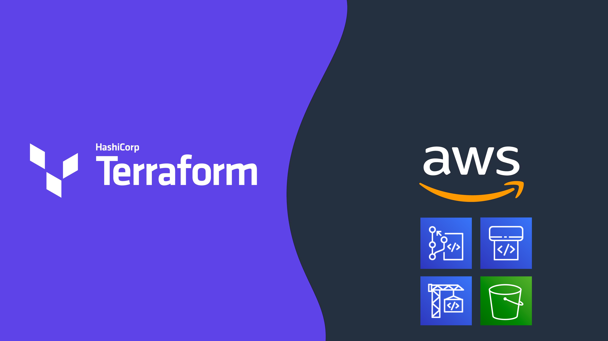

# Terraform CI/CD and Testing on AWS
#### Created by:
[Kevon Mayers](https://www.linkedin.com/in/kevonmayers)

In this workshop you will learn how to leverage the new **Terraform Testing Framework** introduced in v1.7.0 to perform manual as well as automated unit and integration tests for your Terraform projects. You will then learn how to build a Terraform CI/CD pipeline on AWS to automate these tests and deploy your infrastructure safely and securely with Terraform.

 For detailed information and step-by-step guidance, check out the full workshop on **[AWS Workshop Studio](https://catalog.workshops.aws/terraform-cicd-on-aws).**

